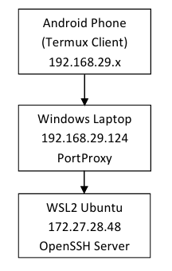

# Remote SSH Access to WSL Ubuntu from Android Termux

## Objective
Establish SSH connectivity from Android Termux to Ubuntu running inside WSL2.

## Technologies Used
- Ubuntu WSL2
- OpenSSH Server
- Windows Firewall
- PortProxy
- Android Termux
- SSH

## Architecture Diagram

## Commands Used

ip addr
ipconfig
ping
netstat -an | findstr :22
ssh tejasrinu@IP

## Problems Faced

- SSH connection timed out
- WSL IP not reachable from mobile
- Port 22 forwarding issues

## Solution

- Verified SSH service status
- Configured Windows Firewall rule
- Verified PortProxy settings
- Tested connectivity using ping
- Connected successfully using SSH

## Results

Successfully established remote SSH access from Android Termux to Ubuntu WSL2.

## Skills Demonstrated

- Linux Administration
- SSH
- Networking
- Troubleshooting
- Windows Firewall
- WSL2
